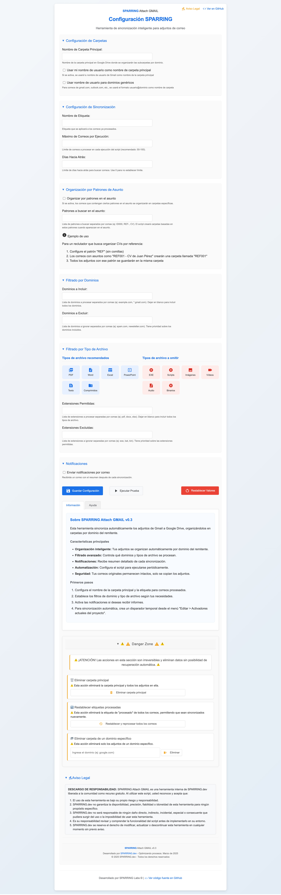

# SPARRING Attach GMAIL Google Script

> Una herramienta de [SPARRING.dev](https://sparring.dev) para simplificar tu vida digital.

*Vista de la interfaz de configuración de SPARRING Attach GMAIL - Marzo 2025*

## ⚠️ Aviso Legal

**DESCARGO DE RESPONSABILIDAD:** SPARRING Attach GMAIL es una herramienta interna de SPARRING.dev liberada a la comunidad como recurso gratuito. Al utilizar este script, usted reconoce y acepta que:

1. El uso de esta herramienta es bajo su propio riesgo y responsabilidad.
2. SPARRING.dev no garantiza la disponibilidad, precisión, fiabilidad o idoneidad de esta herramienta para ningún propósito específico.
3. SPARRING.dev no será responsable de ningún daño directo, indirecto, incidental, especial o consecuente que pudiera surgir del uso o la imposibilidad de usar esta herramienta.
4. Es su responsabilidad revisar y comprender la funcionalidad del script antes de implementarlo en su entorno.
5. SPARRING.dev se reserva el derecho de modificar, actualizar o descontinuar esta herramienta en cualquier momento sin previo aviso.

Para obtener más información sobre nuestras políticas de seguridad y privacidad, consulte nuestro documento [SECURITY.md](https://github.com/SparringLabs/attach-gmail-google-script/blob/main/SECURITY.md).

## 📋 Descripción

**SPARRING Attach GMAIL Google Script** es una solución automatizada que sincroniza los adjuntos de tus correos de Gmail a Google Drive, organizándolos inteligentemente en carpetas según el dominio del remitente. Esta herramienta te permite recuperar fácilmente esos documentos importantes, memes divertidos o archivos Excel que de otra manera se perderían en la inmensidad de tu bandeja de entrada.

## ✨ Características principales

- **Sincronización automática**: Programa el script para ejecutarse cada hora y mantener todos tus adjuntos organizados sin esfuerzo.
- **Organización inteligente**: Estructura por dominio del remitente para encontrar rápidamente lo que buscas.
- **Organización por usuario en dominios genéricos**: Opción para usar el nombre de usuario como carpeta para dominios comunes como Gmail, Outlook, etc.
- **Organización por patrones en el asunto**: Configura patrones específicos (como "ID000", "REF-", "CV") para agrupar automáticamente los adjuntos en carpetas según el asunto.
- **Filtrado avanzado**: Configura qué dominios y tipos de archivos quieres incluir o excluir.
- **Panel de control**: Interfaz de usuario intuitiva para ajustar todos los parámetros sin tocar código.
- **Sistema de notificaciones**: Recibe resúmenes por correo electrónico después de cada sincronización.
- **Etiquetado de correos**: Marca automáticamente los correos procesados para evitar duplicados.
- **Reprocesamiento de correos**: Función para resetear etiquetas y permitir reprocesar correos ya sincronizados.
- **Procesamiento inteligente**: Funciona tanto con correos nuevos como antiguos.
- **Monitoreo de progreso**: Visualiza cuántos correos quedan pendientes y planifica tus ejecuciones.

## 📋 Requisitos previos

- Cuenta de Google activa (Gmail y Google Drive)
- Permisos para crear y ejecutar Google Apps Scripts
- Navegador web (Chrome, Firefox, Safari u otro moderno)

## 🚀 Guía de instalación paso a paso

### 1. Crear un nuevo proyecto de Google Apps Script

1. Abre [Google Apps Script](https://script.google.com/) en tu navegador.
2. Inicia sesión con tu cuenta de Google si se te solicita.
3. Haz clic en el botón **+ Nuevo proyecto** para crear un proyecto vacío.
4. Cambia el nombre del proyecto de "Proyecto sin título" a "SPARRING Attach GMAIL".

### 2. Crear los archivos del proyecto

#### Archivo principal: GmailAttachmentSync.gs

1. Elimina todo el contenido predeterminado del archivo `Código.gs`.
2. Cambia el nombre del archivo a `GmailAttachmentSync.gs` (haz clic en "Código.gs" y edita el nombre).
3. Copia y pega todo el código del archivo `GmailAttachmentSync.gs` proporcionado.

#### Archivo de interfaz: ConfiguracionUI.html

1. En el panel izquierdo, haz clic en el icono **+** junto a "Archivos" para crear un nuevo archivo.
2. Nombra el archivo como `ConfiguracionUI.html`.
3. Copia y pega todo el código HTML proporcionado para la interfaz de usuario.

### 3. Guardar el proyecto

1. El proyecto se guarda automáticamente, pero asegúrate de que no haya errores visibles en el editor.
2. Verifica que los dos archivos (`GmailAttachmentSync.gs` y `ConfiguracionUI.html`) estén correctamente configurados.

### 4. Configurar permisos

1. Haz clic en el botón **Ejecutar** ▶️ en la barra de herramientas superior.
2. Selecciona la función `showConfigurationUI` para ejecutarla.
3. Google te pedirá autorización la primera vez. Haz clic en **Revisar permisos**.
4. Selecciona tu cuenta de Google.
5. Verás una advertencia porque la aplicación no está verificada. Haz clic en **Configuración avanzada**.
6. Haz clic en **Ir a SPARRING Attach GMAIL (no seguro)**.
7. Revisa los permisos solicitados y haz clic en **Permitir**.

### 5. Implementar como aplicación web (opcional pero recomendado)

1. Haz clic en **Implementar** > **Nueva implementación**.
2. Selecciona **Aplicación web** como tipo.
3. Configura los siguientes parámetros:
   - Descripción: "SPARRING Attach GMAIL v1.0"
   - Ejecutar como: "Yo (tu-email@gmail.com)"
   - Quién tiene acceso: "Solo yo"
4. Haz clic en **Implementar**.
5. Copia la URL generada para acceder fácilmente a la interfaz en el futuro.

## ⚙️ Configuración inicial

Después de instalar el script, debes configurarlo según tus necesidades:

1. Abre la interfaz del script (ejecutando `showConfigurationUI` o usando la URL de implementación).
2. Configura los siguientes parámetros básicos:
   - **Nombre de carpeta principal**: Nombre de la carpeta donde se guardarán todos los adjuntos en Google Drive.
   - **Nombre de etiqueta**: Etiqueta que se aplicará a los correos procesados.
   - **Máximo de correos**: Número máximo de correos a procesar por ejecución.
   - **Días hacia atrás**: Límite de días para buscar correos (0 = sin límite).

3. Configura los filtros de dominio:
   - **Dominios a incluir**: Lista de dominios a procesar (vacío = todos).
   - **Dominios a excluir**: Lista de dominios a ignorar (prioridad sobre los incluidos).
   - **Usar nombre de usuario para dominios genéricos**: Activa esta opción para organizar correos de dominios como Gmail, Outlook, etc. usando el formato "usuario@dominio" como nombre de carpeta.

4. Configura la organización por patrones en el asunto:
   - **Organizar por patrones en el asunto**: Activa esta opción para clasificar los adjuntos en carpetas basadas en patrones del asunto.
   - **Patrones a buscar en el asunto**: Lista de palabras clave o referencias (ej: "ID000", "REF-", "CV") separadas por comas.
   - **Funcionamiento**: Cuando el script encuentra un correo con alguno de estos patrones en el asunto (por ejemplo: "REF001 - CV de Juan Pérez"), creará una carpeta con el patrón completo ("REF001") en lugar de usar el dominio del remitente.
   - **Ejemplo de uso**: Ideal para reclutadores que reciben CVs con referencias específicas o cualquier caso donde el asunto contenga identificadores únicos relevantes para la organización.

5. Configura los filtros de tipo de archivo:
   - **Extensiones permitidas**: Selecciona los tipos de archivo a procesar utilizando la interfaz visual con íconos.
   - **Extensiones excluidas**: Marca los tipos de archivo que deseas ignorar.
   - Tipos preconfigurados: Documentos (PDF, Word, Excel, PowerPoint), imágenes, comprimidos, y más.
   - Por defecto se excluyen automáticamente los archivos de calendario (.ics) de las invitaciones a eventos.
   - Interfaz visual intuitiva que te permite ver claramente qué tipos están permitidos y cuáles excluidos.

5. Configura las notificaciones:
   - Activa/desactiva el envío de notificaciones por correo.
   - Elige el nivel de detalle (básico o detallado).

6. Gestiona la **Danger Zone** (Zona de Peligro):
   - ⚠️ **Eliminar carpeta principal**: Permite eliminar completamente la carpeta principal y todos sus contenidos.
   - ⚠️ **Restablecer etiquetas procesadas**: Elimina la etiqueta de "procesado" de todos los correos, permitiéndote sincronizarlos nuevamente.
   - ⚠️ **Eliminar carpeta de un dominio específico**: Borra únicamente los adjuntos de un dominio en particular.
   - Esta sección incluye advertencias visuales claras para acciones irreversibles.

7. Haz clic en **Guardar Configuración** para aplicar los cambios.

## 🔄 Automatización del script

Para que el script se ejecute automáticamente y sincronice tus adjuntos de forma periódica:

1. Dentro del editor de Google Apps Script, haz clic en **Editar** > **Activadores actuales del proyecto**.
2. Haz clic en **Añadir activador**.
3. Configura el activador con los siguientes parámetros:
   - Función a ejecutar: "syncAttachments"
   - Evento de origen: "Basado en tiempo"
   - Tipo de activador basado en tiempo: "Temporizador de horas"
   - Intervalo de horas: "Cada hora" (o ajusta según tus necesidades)
4. Haz clic en **Guardar**.

El script ahora se ejecutará automáticamente según el intervalo configurado.

## 🎮 Uso diario

### Interfaz de usuario

1. Accede a la interfaz desde el panel de Google Apps Script ejecutando la función `showConfigurationUI` o usando la URL de implementación.
2. Navega por las diferentes secciones usando las pestañas y secciones plegables.
3. Realiza cambios en la configuración según necesites.
4. Usa el botón **Ejecutar Prueba** para probar la sincronización con la configuración actual.
5. Ejecuta la función `obtenerEstadoPendientes()` para ver un resumen de correos pendientes y planificar tus ejecuciones.

### Notificaciones

Después de cada sincronización, si has activado las notificaciones, recibirás un correo electrónico con:
- Fecha y hora de sincronización
- Número de correos procesados
- Número de adjuntos guardados
- **Correos pendientes por procesar**
- **Ejecuciones estimadas para completar**
- Tiempo total de ejecución
- Enlace a la carpeta principal en Google Drive
- Estadísticas adicionales (en notificaciones detalladas)

### Acceso a archivos sincronizados

1. Abre Google Drive.
2. Navega a la carpeta principal configurada (nombre predeterminado: "Adjuntos de Gmail").
3. Dentro encontrarás carpetas organizadas por dominio del remitente.
4. Dentro de cada carpeta de dominio, encontrarás todos los adjuntos de ese remitente.

### Gestión de carpetas y etiquetas (Danger Zone)

La interfaz incluye una sección especial llamada **Danger Zone** que te permite gestionar las carpetas de almacenamiento y etiquetas de correos:

1. **Eliminar carpeta principal**:
   - Elimina completamente la carpeta principal y todos los adjuntos guardados.
   - Útil cuando quieres reiniciar todo el sistema de sincronización.
   - ⚠️ **Advertencia**: Esta acción es irreversible.

2. **Eliminar carpeta de un dominio específico**:
   - Permite eliminar selectivamente los adjuntos de un dominio específico.
   - Especifica el dominio exacto (ej: google.com) en el campo de texto.
   - Útil para eliminar adjuntos de remitentes que ya no necesitas conservar.
   - ⚠️ **Advertencia**: Los archivos eliminados no pueden recuperarse automáticamente.

3. **Resetear etiquetas procesadas**:
   - Quita la etiqueta de todos los correos marcados como procesados.
   - Permite que estos correos sean procesados nuevamente en la próxima ejecución.
   - Útil cuando has cambiado la configuración y quieres volver a procesar correos antiguos.
   - ⚠️ **Advertencia**: Esto puede generar duplicados si los correos ya fueron procesados correctamente.

## 🛠️ Resolución de problemas

### El script no procesa correos antiguos

**Solución**: Aumenta el valor de "Días hacia atrás" en la configuración o establécelo a 0 para no tener límite. Usa la función `obtenerEstadoPendientes()` para verificar cuántos correos quedan sin procesar.

### Algunos adjuntos no se guardan

**Posibles causas y soluciones**:
- **Tamaño del archivo**: Google Drive tiene límites de tamaño. Verifica que tus adjuntos no excedan estos límites.
- **Filtros de dominio/extensión**: Revisa la configuración para asegurarte de que no estás excluyendo involuntariamente ciertos dominios o tipos de archivo.
- **Permisos**: Asegúrate de haber concedido los permisos necesarios al script.

### El script se detiene o muestra errores

**Solución**: Consulta los registros de ejecución:
1. En el editor de Google Apps Script, haz clic en **Ejecución** > **Registros de ejecución**.
2. Revisa los mensajes de error para identificar el problema específico.

### Límites de cuota de Google Apps Script

Si el script se detiene debido a límites de cuota:
1. Reduce la frecuencia de ejecución automática.
2. Disminuye el valor de "Máximo de correos" en la configuración.
3. Divide el procesamiento en lotes más pequeños.
4. Usa la función `obtenerEstadoPendientes()` para monitorear el progreso y planificar ejecuciones en diferentes momentos del día.

### Gestión de tipos de archivo

El script ofrece una interfaz visual avanzada para gestionar los tipos de archivo:

1. **Interfaz con iconos**: Cada tipo de archivo se representa con un icono visual intuitivo.
2. **Categorías predefinidas**:
   - Documentos: PDF, Word, Excel, PowerPoint, texto
   - Imágenes: jpg, png, gif, bmp, svg
   - Videos: mp4, avi, mov, mkv
   - Audio: mp3, wav, ogg
   - Comprimidos: zip, rar, 7z
   - Y muchos más
3. **Selección visual**: Haz clic en los iconos para incluir (azul) o excluir (rojo) tipos específicos.
4. **Flexibilidad**: Puedes seleccionar tipos individuales o categorías completas.
5. **Comportamiento predeterminado**: Si no seleccionas ninguno, se procesarán todos los tipos de archivos.

## ❓ Preguntas frecuentes

### ¿El script elimina mis correos originales?
No, el script solo lee tus correos y guarda copias de los adjuntos en Google Drive. Tus correos originales permanecen intactos.

### ¿Puedo sincronizar adjuntos de correos antiguos?
Sí, el script puede procesar correos antiguos. Ajusta el parámetro "Días hacia atrás" según necesites o establécelo a 0 para no tener límite temporal. La función `obtenerEstadoPendientes()` te mostrará cuántos correos quedan por procesar y cuántas ejecuciones se necesitan para completar.

### ¿Puedo reprocesar correos que ya fueron sincronizados?
Sí, puedes utilizar la función "Resetear etiquetas procesadas" en la sección Danger Zone. Esta función quita la etiqueta de todos los correos procesados, permitiendo que sean procesados nuevamente en la próxima ejecución. Esto es útil si has cambiado la configuración y quieres aplicar los nuevos ajustes a correos ya procesados.

### ¿Cómo funciona el filtrado por dominio?
- Puedes incluir dominios específicos (ej: `empresa.com, cliente.org`)
- Puedes usar comodines (ej: `*.gobierno.es`)
- Los dominios excluidos tienen prioridad sobre los incluidos
- Para dominios genéricos como gmail.com, outlook.com, etc., puedes habilitar la opción de usar el nombre de usuario como carpeta

### ¿Cómo funciona la organización por patrones en el asunto?
- Activa la opción "Usar patrones en asunto" en la configuración
- Especifica patrones (por ejemplo: `CV-`, `REF:`, `ID-`) separados por comas
- Cuando el asunto del correo contiene uno de estos patrones, los adjuntos se guardarán en una subcarpeta con ese nombre
- Esta función es útil para organizar automáticamente adjuntos de correos con referencias específicas, como CVs de candidatos, números de factura, etc.

### ¿Qué sucede si un adjunto ya existe en Drive?
El script verifica si el archivo ya existe antes de guardarlo. Si encuentra un archivo con el mismo nombre en la misma ubicación, añadirá un sufijo numérico para evitar sobrescribirlo.

### ¿Puedo modificar el código para añadir funcionalidades?
Sí, el código está disponible en el editor de Google Apps Script y puedes modificarlo según tus necesidades. Si no tienes experiencia con JavaScript, considera hacer una copia de seguridad antes de realizar cambios importantes.

## 📞 Soporte y contacto

Para obtener ayuda, reportar problemas o sugerir mejoras:

- Visita [SPARRING.dev](https://sparring.dev)
- Envía un correo a support@sparring.dev
- Abre un issue en nuestro repositorio de GitHub

## 📜 Licencia

Este proyecto es software libre y se distribuye bajo la licencia MIT. Consulta el archivo LICENSE para más detalles.

---

Desarrollado con ❤️ por el equipo de [SPARRING.dev](https://sparring.dev) - Optimizando procesos. Marzo de 2025.
